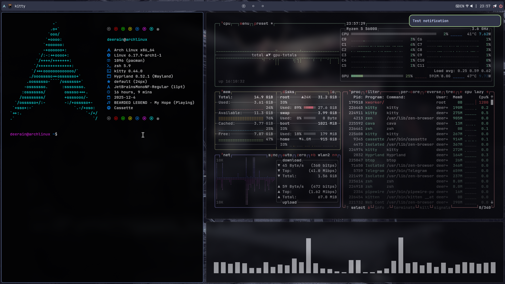
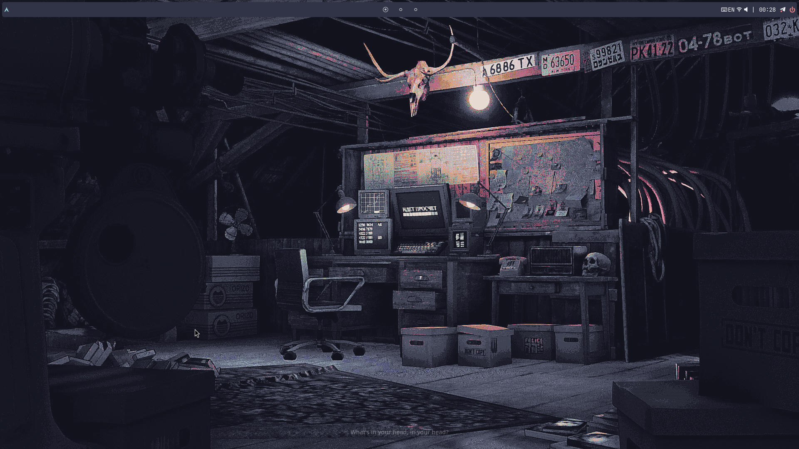
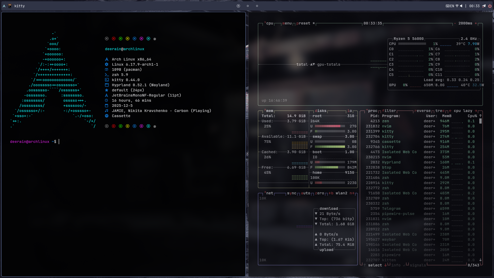
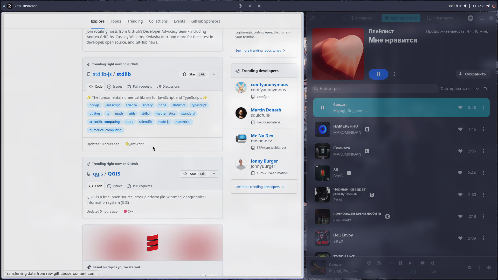

# Ugly But Mine



<details>
<summary><h2>📸 Скриншоты (нажмите чтобы развернуть)</h2></summary>


    

    

</details>

<details>
<summary><h2>🚀 Установка:</h2></summary>

### AUR
``` bash
https://github.com/Deeerain/my-dots.git
```
``` bash
cd my-dots
```
``` bash
makepkg -i
```
</details>

<details>
<summary><h2>📄 Описанние</h2></summary>
<table style="width: 100%">
    <tbody>
        <tr>
            <td>hyprland</td>
            <td>Композитор</td>
        </tr>
        <tr>
            <td>hyprpaper</td>
            <td>Обои</td>
        </tr>
        <tr>
            <td>hyprlock</td>
            <td>Экран блокировки</td>
        </tr>
        <tr>
            <td>mako</td>
            <td>Уведомления</td>
        </tr>
        <tr>
            <td>grim + slurp</td>
            <td>Скриншоты</td>
        </tr>
        <tr>
            <td>zsh</td>
            <td>Шелл</td>
        </tr>
        <tr>
            <td>exa</td>
            <td>Замена ls</td>
        </tr>
        <tr>
            <td>nwg-look</td>
            <td>Управление GTK темой</td>
        </tr>
        <tr>
            <td>gmd</td>
            <td>Экран входа в систему</td>
        </tr>
        <tr>
            <td>grub</td>
            <td>Загрузчик <a href="https://github.com/Jacksaur/Gorgeous-GRUB">Graphite</a></td>
        </tr>
    <tbody>
</table>
</details>
